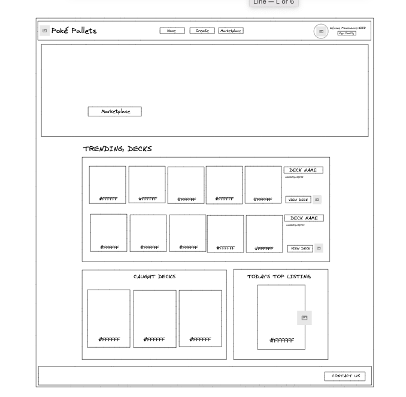

# Palette Town

# Description

Welcome to [Palette Town]()! Have an interest in Pokémon? Having a tough time thinking of a color palette? Create a Pokémon deck here and give it a ~vibe~. Using the open source Pokémon API, you can create a deck of 60 cards then let the application compute a color palette of 5 for you. Share your created decks with the community, and save your favorites.

## Table of Contents
- [Description](#description)
- [Development](#development)
- [Technologies](#technologies)
- [Screenshots](#screenshots)
- [Credits](#credits)

# Development

As fans of Pokémon, the team wanted to be able to give their card decks an aesthetic or a sense of individuality to share with other users. 

# Technologies

| Tech         | Description |
| ----------- | ----------- |
| [Pokémon API](https://docs.pokemontcg.io/) | Pokémon Trading Card Game API to source data from available cards. |
| [Tailwind CSS](https://tailwindcss.com/) | This is an open source, utility-first CSS framework for styling dynamic webpages.|
| [React](https://react.dev/) |  |
| [React Icons](https://react-icons.github.io/react-icons/) |  |
| [React Toastify](https://fkhadra.github.io/react-toastify/introduction/) |  |
| [Sass](https://sass-lang.com/documentation/js-api/) |   |
| [GraphQL](https://graphql.org/)  |   |
| [Stripe](https://stripe.com/docs/payments/payment-methods) |  |

# Screenshots

# Credits

| Developers         | GitHub Profile|
| -----------  | ----------- |
|Jackson Maltby | [jacksonmaltby](https://github.com/jacksonmaltby)  |
|Marley Schneider|[marleyschneiderr](https://github.com/marleyschneiderr)
|Tyler Kervella |[tykervella](https://github.com/tykervella)
|Terri Mack|[terrinmack](https://github.com/terrinmack) |